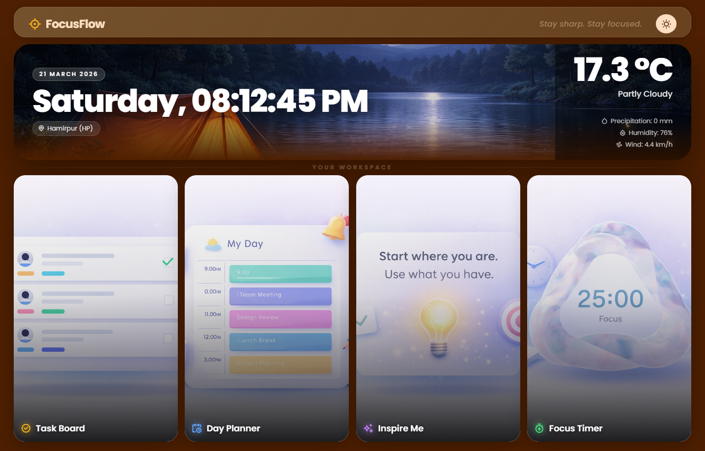
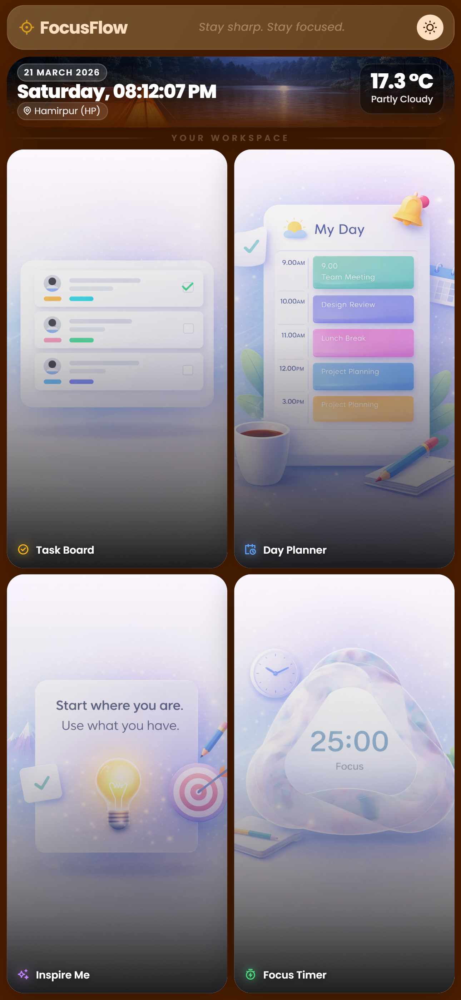

# FocusFlow — Productivity Dashboard

A clean, mobile-first productivity dashboard with real-time weather, task board, day planner, daily inspiration, and a focus timer. Built with vanilla HTML, SCSS, and JavaScript — no frameworks, no dependencies.

---

## ✨ Features

| Feature | Description |
|---|---|
| 🌤️ **Live Weather** | Real-time conditions via Open-Meteo API (temp, humidity, precipitation, wind) |
| 🕐 **Live Clock** | Date and time updated every second, 12-hour format |
| ✅ **Task Board** | Add, detail, flag as important, and mark tasks done — persisted via localStorage |
| 📅 **Day Planner** | 18 hourly slots (6:00–23:00), auto-saved as you type |
| 💬 **Daily Inspiration** | Random motivational quote fetched on every visit |
| ⏱️ **Focus Timer** | 25-min work / 5-min break Pomodoro cycle |
| 🌙 **Dark Mode** | Toggle between warm light and cool dark theme |
| 📱 **Fully Responsive** | Mobile-first — tested on iPhone SE, iPhone 14 Pro Max, tablet, and desktop |

---

## 🖥️ Preview

### Desktop


### Mobile


---

## 📁 Project Structure

```
FocusFlow/
├── index.html          # Main HTML
├── style.scss          # Source styles (mobile-first SCSS)
├── style.css           # Compiled CSS
├── script.js           # Vanilla JS
└── assets/
    ├── Morning.png               # Header background — morning
    ├── Evening.png               # Header background — evening
    ├── Night.png                 # Header background — night
    ├── Task Board.png            # Card image — landscape
    ├── Day Planner.png           # Card image — landscape
    ├── Inspire Me.png            # Card image — landscape
    ├── Focus Time.png            # Card image — landscape
    ├── Task Board Portrait.png   # Card image — portrait (mobile)
    ├── Day Planner Portrait.png  # Card image — portrait (mobile)
    ├── Inspire Me Portrait.png   # Card image — portrait (mobile)
    ├── Focus Time Portrait.png   # Card image — portrait (mobile)
    └── favicon.svg
```

---

## 🚀 Getting Started

No build step required for HTML and JS. SCSS compilation is only needed if you want to edit styles.

### 1. Clone the repo

```bash
git clone https://github.com/NovaWhisperer/focusflow.git
cd focusflow
```

### 2. Open in browser

Just open `index.html` directly — or use a local server for best results:

```bash
# With Node
npx serve .
```

Or use the **Live Server** extension in VS Code.

### 3. Compile SCSS (optional — `style.css` is already included)

```bash
sass style.scss style.css --watch
```

> ⚠️ Weather requires a network connection. If offline, the dashboard falls back to a time-based background image.

---

## 🛠️ Tech Stack

- **HTML5** — semantic, accessible markup
- **SCSS** — compiled to CSS, no runtime dependency
- **Vanilla JavaScript** — ES2020+, no frameworks
- **[Open-Meteo API](https://open-meteo.com/)** — free weather data, no API key needed
- **[dummyjson API](https://dummyjson.com/)** — random motivational quotes
- **[Remixicon](https://remixicon.com/)** — icon library via CDN
- **[Poppins](https://fonts.google.com/specimen/Poppins)** — typeface via Google Fonts

---

## 📍 Changing Your Location

Open `script.js` and edit the `CONFIG` object at the very top of the file:

```js
const CONFIG = {
    location: {
        name:      "Hamirpur (HP)",   // shown in the UI
        latitude:  31.68,             // your latitude
        longitude: 76.52,             // your longitude
        timezone:  "Asia/Kolkata",    // your timezone
    }
};
```

- Find your coordinates → [latlong.net](https://www.latlong.net)
- Find your timezone string → [timezonefinder.michelfe.eu](https://timezonefinder.michelfe.eu)

The weather cache updates automatically when you change the coordinates.

---

## 📱 Responsive Breakpoints

| Breakpoint | Target |
|---|---|
| Base (default) | Mobile `< 480px` |
| `min-width: 480px` | Small phones / landscape |
| `min-width: 768px` | Tablet |
| `min-width: 1200px` | Desktop |

---

## 📄 License

MIT — free to use, modify, and distribute.

---

<p align="center">Built with ☕ and patience.</p>
